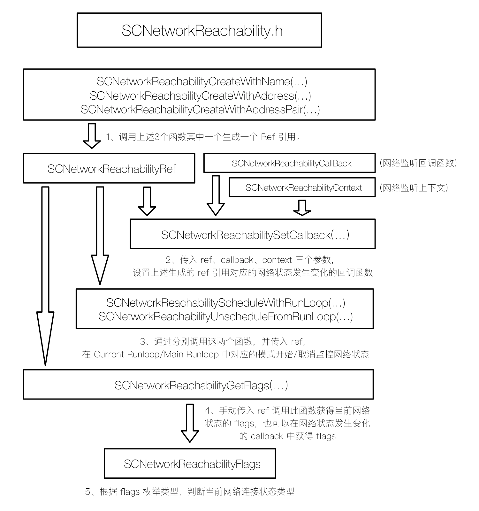

1. 首先在 `SCNetworkReachabilityCreateWithName(...)`、`SCNetworkReachabilityCreateWithAddress(...)`、`SCNetworkReachabilityCreateWithAddressPair(...) `3个初始化函数中任选其一创建一个 `SCNetworkReachabilityRef` 引用；
2. 其次根据 `SCNetworkReachabilityCallBack` 定义一个网络监听回调函数，并初始化一个 `SCNetworkReachabilityContext` 上下文信息，然后调用 `SCNetworkReachabilitySetCallback` 函数并传入上述 `ref`、`callback`、`context` 3个参数，设置上述创建的 `ref` 在网络状态发生变化时的回调函数；
3. 通过调用 `SCNetworkReachabilityScheduleWithRunLoop(...) `或 `SCNetworkReachabilityUnscheduleFromRunLoop(...)` 函数并传入上述 `ref`，在 `Current Runloop` 中开始或取消监听网络连接状态变化，另外也可以通过 `SCNetworkReachabilitySetDispatchQueue(...) `函数设置在指定线程里监听；
4. 调用 `SCNetworkReachabilityGetFlags(...) `函数并传入上述 `ref`，可获得当前网络连接状态的 `flags` 枚举值，另外需要注意的是，当 DNS 服务器无法连接，或者在弱网环境下，此函数将会很耗时，所以苹果建议在子线程里异步调用此函数；
5. 根据不同的 `SCNetworkReachabilityFlags` 枚举值，判断当前网络连接状态和连接类型。

